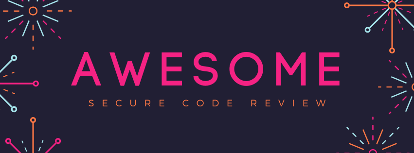

# awesome-secure-code-review

# Awesome Secure Code Review 

> A curated list of tools, articles, books, and any other resource related to [Secure Code Review](https://www.synopsys.com/glossary/what-is-code-review.html#:~:text=Secure%20code%20review%20is%20a,style%20guidelines%2C%20among%20other%20activities.)

Please, note this is a bilingual repository, so not all the content is made in english. In front of the content, the language of the content will be indicate under brackets.

## Contents

- [Articles](#articles)
- [Talks](#talks)
- [Tools](#tools)
- [License](#license)

## Articles

- [A Comprehensive Guide to Secure Code Review](https://medium.com/@krunal-kawa/a-comprehensive-guide-to-secure-code-review-529e31897b53) [EN] 
- [How to conduct a secure code review](https://www.techtarget.com/searchsecurity/tip/How-to-conduct-a-secure-code-review) [EN] 
- [Secure Code Review Best Practices [cheat sheet included]](https://blog.gitguardian.com/secure-code-review-cheat-sheet-included/) [EN]  
- [The developer's guite to a secure code review](https://www.tabnine.com/blog/the-developers-guide-to-a-secure-code-review/) [EN] 
- [What Is Secure Code Review? Process, Tools, and Best Practices](https://www.aquasec.com/cloud-native-academy/devsecops/secure-code-review/) [EN]

## Talks

- [How to conduct a basic security code review | Vickie Li](https://www.youtube.com/watch?v=e52nVG7wR2Q) [EN] 
- [In code review we trust! Finding security bugs | Helena Carreço](https://www.youtube.com/watch?v=gewNYKjYybA&t=5586s) [PT/BR] 
- [How to Analyze Code for Vulnerabilities | Vickie Li](https://www.youtube.com/watch?v=A8CNysN-lOM) [EN]  

## Tools

- [Checkmarx](https://checkmarx.com/) [Pay]
- [Semgrep](https://semgrep.dev/) [Pay]
- [Veracode](https://www.veracode.com/) [Pay]

## License

